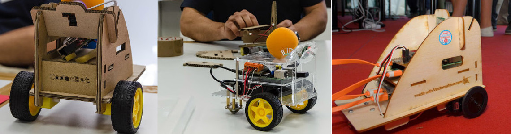
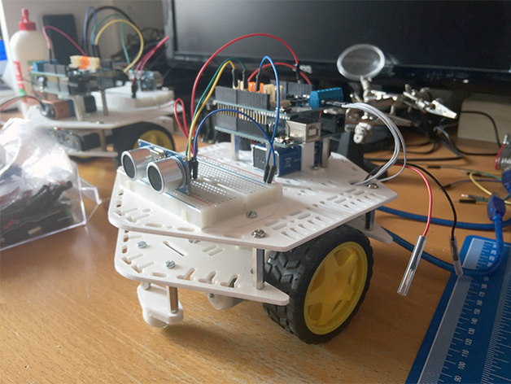

Let's build a TJBot with Raspberry and IBM.

Leggi la [WIKI](https://github.com/omartek/Tjbot_at_school/wiki) per dettagli e link utili.

Buona lettura.

ALTRI DIY ROBOT:

http://www.coderbot.org/it/how_to_build_it.html

https://www.fabsussidiario.it/

https://www.thingiverse.com/thing:2791074

https://www.thingiverse.com/thing:1441937

http://www.maffucci.it/2016/05/06/dotbot-avanzamento-lavori-e-sviluppi-futuri/

https://www.ottodiy.com/

http://www.instructables.com/id/Otto-Build-You-Own-Robot-in-Two-Hours/

https://www.thingiverse.com/thing:1568652/

https://github.com/bqlabs/zowi
